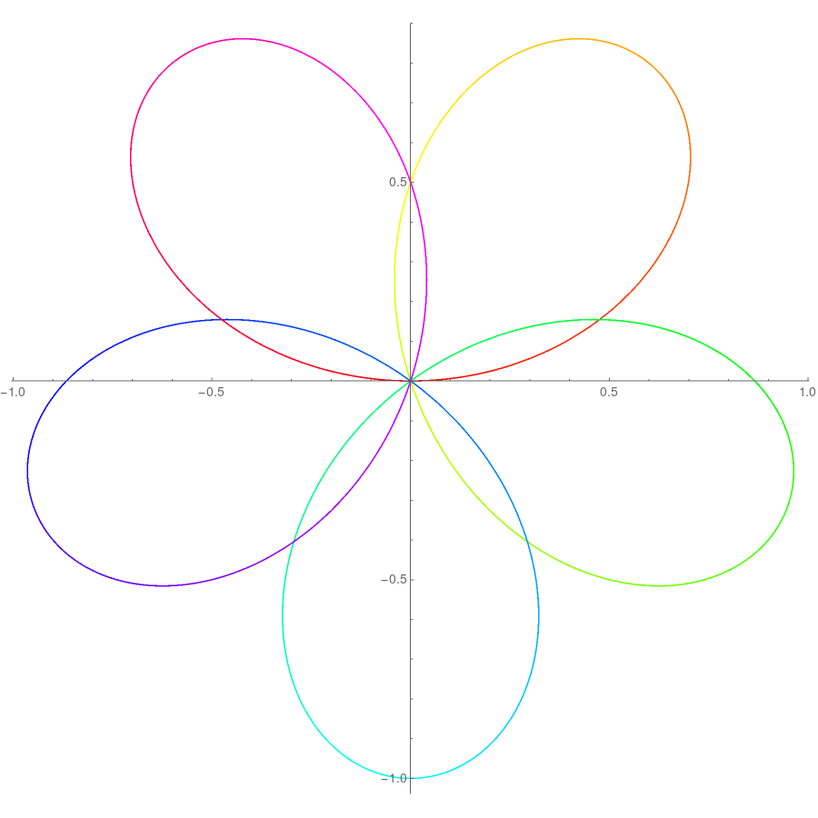

# Mado

基于 mirai, Graia 的 QQ 机器人

> 项目名称来源于《[魔法少女小圆](https://mzh.moegirl.org.cn/%E9%AD%94%E6%B3%95%E5%B0%91%E5%A5%B3%E5%B0%8F%E5%9C%86)》 [鹿目圆香](https://mzh.moegirl.org.cn/%E9%B9%BF%E7%9B%AE%E5%9C%86)（Kaname **Mado**ka）。  
> <i><b>Ma</b>d</i>o<b><i>ka</i></b> 与 <i><b>Ma</b>t</i>hemati<b><i>ca</i></b> 的最长公共子序列长度竟然达到了 4，*这种事绝对很奇怪啊*。
> 
> ~~圆：我被绑架到中国科大当 bot 样本。~~

### 特点

+ 可以执行 python3, Mathematica, C++ 等代码
+ 对于 Mathematica，支持以图片格式输入代码、输出计算结果
+ 支持 GitHub Copilot 补全
+ 可以给出错误提示，有执行时间限制
+ 支持好友访问和群访问

### 不足

- 权限管理部分薄弱

<br/>

## 使用

机器人 QQ 号：2944791899

### 主要指令

| 指令                           | 含义                                                         |
| :----------------------------- | :----------------------------------------------------------- |
| **epy** *[options]*<br/>*code* | 执行 Python3 代码，<br />而 **ema**, **ecp**, **ejs**, **erb** 分别代表执行 Mathematica, C++, JavaScript, Ruby 代码 |
| **cpy**<br />*code*            | 使用 GitHub Copilot 补全 Python 代码                         |
| **co** *suffix*<br />*code*    | 使用 GitHub Copilot 补全后缀为 suffix 的文件                 |
| **pip install** *package*      | Python 库安装                                                |
| **help**                       | 查看帮助信息                                                 |

### 选项

| 选项               | 含义                       |
|:---------------- |:------------------------ |
| **-p**           | 以 PNG 格式返回（仅适用于 **ema**） |
| **-g**           | 以 GIF 格式返回（仅适用于 **ema**） |
| **-t** *seconds* | 修改时间限制（默认 15 秒，需要权限）     |
| **-o**           | 不对输出字符数及行数进行限制（需要权限）     |

<br/>

### 示例

#### 1. 执行 Python

```python
epy
for i in range(5):
 if i%3==1:
  print(i)
```

该程序打印 [0, 5) 中被 3 除余 1 的整数 ：

> 1  
> 4

<br/>

#### 2. 执行 Mathematica

##### 2.1 文本格式

```mathematica
ema
f[1]=f[2]= 1;
f[n_]:=f[n]= f[n-1]+f[n-2];
Array[f, 10]
f[100]
```

此代码计算前 10 个以及第 100 个 Fibonacci 数：

> {1, 1, 2, 3, 5, 8, 13, 21, 34, 55}  
> 354224848179261915075

<br/>

##### 2.2 以图像格式输出

```mathematica
ema -p
PolarPlot[Sin[5t/3], {t,0,3Pi}, ColorFunction->(Hue[#3]&), ImageSize->{900,900}]
```

这段代码绘制 =\sin\frac{5t}3\ (0\leq t\leq 3\pi)) 的极坐标图像：

> 

<br/>

##### 2.3 以图像格式输入输出

<pre>
ema -p
Colorize@ MorphologicalComponents@ DeleteBorderComponents@

</pre>


该代码用不同的颜色区分黑白图片中的各个非边界的连通分量：

> 

<br/>

#### 3. Copilot 补全

```python
cpy
import numpy
# arr is random array, size 5
```

> ```python
> arr = numpy.random.randint(0, 10, 5)
> ```

<br/>

默认会在输入文本后面添加一个空行。在末尾加上 `$` 表示最后一行没有结束，例如

```python
co py
# 打印 1 到 200 的整数，不足 3 位在前面补 0
for$
```

> ```python
> for i in range(1, 201):
>     print('%03d' % i, end=' ')
> ```

<br/>

## 部署

### 环境

#### mirai

建议使用 [mirai-console-loader](https://github.com/iTXTech/mirai-console-loader) 安装及配置 `mirai`

+ `mirai-console` `mirai-console-terminal` `mirai-core-all` 版本选择 `2.10.1`。
+ `mirai-api-http` 版本 `2.5.0`

> 不保证在其他版本下是否可以正常运行

#### Ariadne

版本建议选择 `0.6.15`

```bash
pip install graia-ariadne
```

#### Copilot

配置 [copilot neovim](https://github.com/github/copilot.vim)

```bash
pip install neovim
pip install nest_asyncio
```

<br/>

### 运行

先在一个终端中启动 `mirai`

```bash
./mcl -u
```

`clone` 此仓库后，打开一个终端，输入

```
export NVIM_LISTEN_ADDRESS=/tmp/nvim
mkdir temp
nvim temp/test.py
```

再打开一个终端，输入

```bash
python3 main.py
```

<br/>

## 备注

### 作出贡献

欢迎提出建议，欢迎 pull request  
项目地址：<https://github.com/GWDx/Mado>

### 关于协议

本仓库基于的项目 [mirai](https://github.com/mamoe/mirai) 和 [Graia](https://github.com/GraiaProject/Application) 均使用 AGPL 协议。

### 鸣谢

本项目灵感来自 [liqibot2](https://github.com/fyr233/liqibot2) 。

感谢以下项目：

+ [mirai](https://github.com/mamoe/mirai)
+ [mirai-console](https://github.com/mamoe/mirai-console)
+ [mirai-console-loader](https://github.com/iTXTech/mirai-console-loader)
+ [mirai-api-http](https://github.com/project-mirai/mirai-api-http)
+ [Ariadne](https://github.com/GraiaProject/Ariadne)
+ [copilot.vim](https://github.com/github/copilot.vim)
+ [pynvim](https://github.com/neovim/pynvim)

同时感谢 [中国科学技术大学 Vlab 实验平台](https://vlab.ustc.edu.cn/) 提供 7*24 小时的运行环境。

